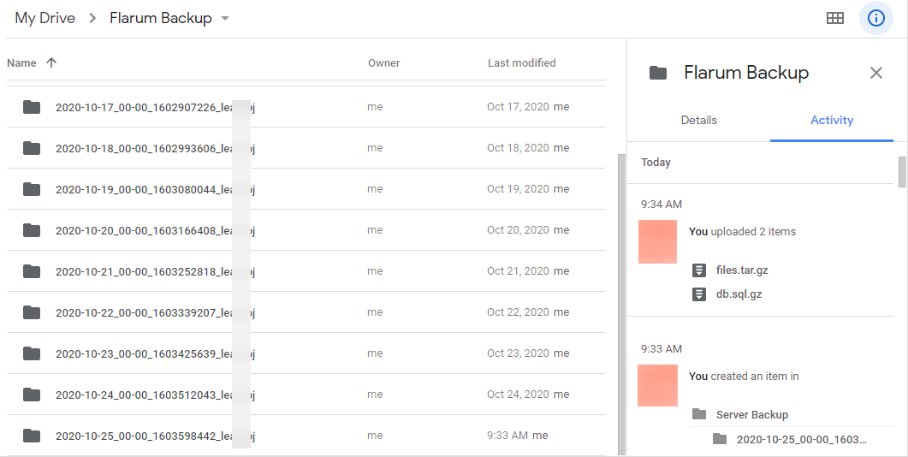

# backup-flarum
 This is a script to push a backup of your Flarum Instance to Cloud Storage using rclone

BUT you can use this even for Wordpress and all other forums

[Click Here](https://rclone.org/overview/) to see the list of Cloud Storages we can upload our Backups to

## Make Sure to Create a Backup of your Server before trying
*2nd last line in script is dangerous if you don't point it to correct directory*

## Screenshots




## Hello r4nchy, Please explain how will this work ?

- a directory with current date and time will be created
- zipped database & flarum folder will be stored in the newly created folder
- we will push this backup to our Cloud
- and delete the rest of the backups on our server which are older than 2 Days

#### update_backup.sh
```sh
# #!/usr/bin/env bash
NAMEDATE=`date +%F_%H-%M_%s`_`whoami` && echo $NAMEDATE
mkdir ~/flarum_backup/$NAMEDATE -m 0755 && echo "Directory Created"
mysqldump -u <DATABASEUSERNAME> -p"<DATABASEPASSWORD>" <DATABASENAME> | gzip > ~/flarum_backup/$NAMEDATE/db.sql.gz && echo "Database Dumped"
tar czf ~/flarum_backup/$NAMEDATE/files.tar.gz ~/<PATH_TO_FLARUM> && echo "Server Files Dumped"
chmod -R 0644 ~/flarum_backup/$NAMEDATE/* && echo "Directory Permission Restored"
/home/<HOSTINGUSERNAME>/flarum_backup/rclone copy ~/flarum_backup/$NAMEDATE "gdrive:Flarum Backup/$NAMEDATE"
cd ~/flarum_backup; find . -type d -mtime +2 -exec rm -rf {} \; 2>&1 && echo "Directory older than 2 days Deleted !!"
exit 0 
```

## Configuration

### update_backup.sh

Create a Directory `flarum_backup` on your server
(e.g /home/HOSTINGUSERNAME/flarum_backup)

Download [rclone](https://rclone.org/downloads/) . (For most it would be rclone Linux x64)

unzip the contents of [rclone-v1.xx.x-linux-amd64.zip]

copy `rclone` [12 Megabytes] file to our `flarum_backup` directory

copy `update_backup.sh` to `flarum_backup` directory and edit the following

`<DATABASEUSERNAME>` - database username

`<DATABASEPASSWORD>` - database password

`<DATABASENAME>` - database name

`<HOSTINGUSERNAME>` - run `pwd` in your terminal to get the server username

`<PATH_TO_FLARUM>` - Location of your root flarum (This will even backup vendor dir, we will include this as it takes less than 50 megabytes)

### rclone

We will use `Google Drive` as an Example

Run `./rclone config`

Create a New Remote (in our case it is named `gdrive`)

Choose `13` to select Google Drive as our Cloud Storage (you can choose other Storages from the list)

Select Role `1`

Follow the steps, verify your google drive and complete the setup

Run `./rclone lsd gdrive:` to see if it is configured correctly. All the folders in `My Drive` will be listed

Note: It is recommended to use your own `CLIENT_ID` & `CLIENT_SECRET`, refer [here](https://github.com/alx-xlx/goindex#get-google-clientid-and-secretid)

## Backup Manually

You can simply open SSH and Run

```sh
bash update_backup.sh
```
OR

You can run commands individually to see how much resource it takes for each specific task


## Automatic/Schedule Backup

If you have "Cron Jobs" service in your c-panel then 

```
0 0 * * * /bin/bash ~/flarum_backup/update_backup.sh >> /home/learjrbj/flarum_backup/update_log 2>&1;
```

The above cronjob will run the `update_backup.sh` everyday and backup everything to your configured cloud using rclone

*You can also create a python OR nodejs script to automate incase you don't have Cron in your C-PANEL*


## Cons

- While using google drive in rclone, new "Flarum Backup" folders were being created each time a new upload were made (however I couldn't reproduce the issue later)

- your email and password for few cloud storages may float around in the `/home/HOSTINGUSERNAME/.config/rclone/rclone.conf` file